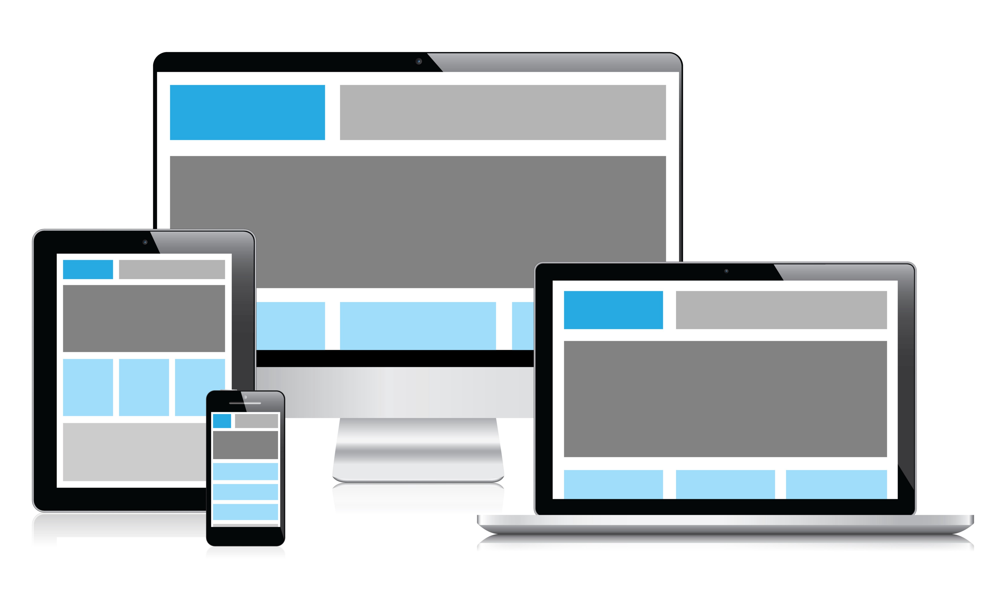

# Responsive-Web-Design

I create this project at my BeCode training in 2021.

The goal of this challenge is to practice the **media queries** 


## what is media queries in css ?

Media queries are a feature of CSS that enable webpage content to adapt to different screen sizes and resolutions. They are a fundamental part of responsive web design and are used to customize the appearance of websites for multiple devices.




## Syntax of a media query :
``` MD
 @ media not/only mediatype and media feature {
     .myCode{
         ...
     }
 }
 ```

 ## How does it work ?

 The media queries acts as a container for the rules and selectors to be applied, therefore, everything that begins with the opening of a key and ends with the closing of it. As for the syntax, a media query always starts with the @media flag, followed by a mediatype.

 :wink:


[Here is my exercice](https://zena-alsibaai.github.io/Responsive-Web-Design/)